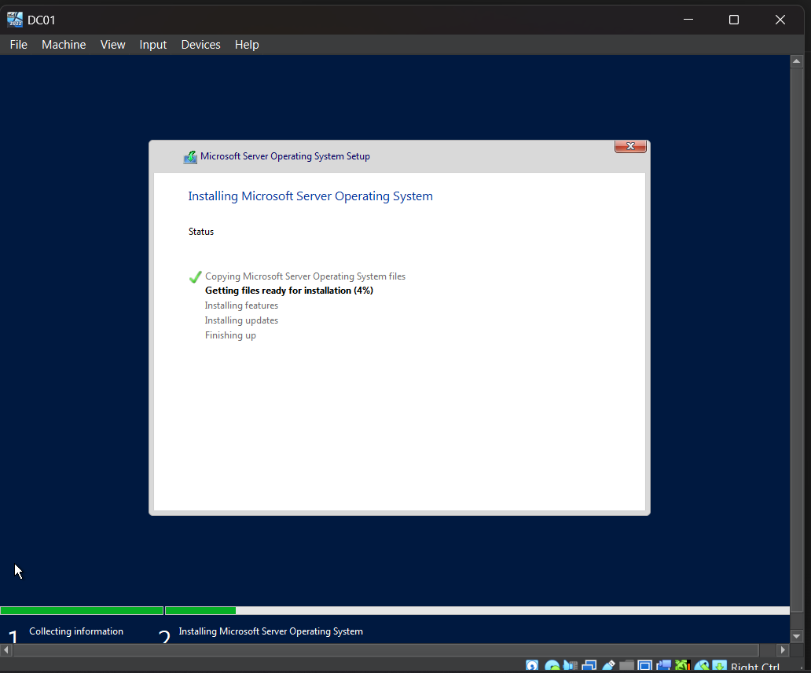
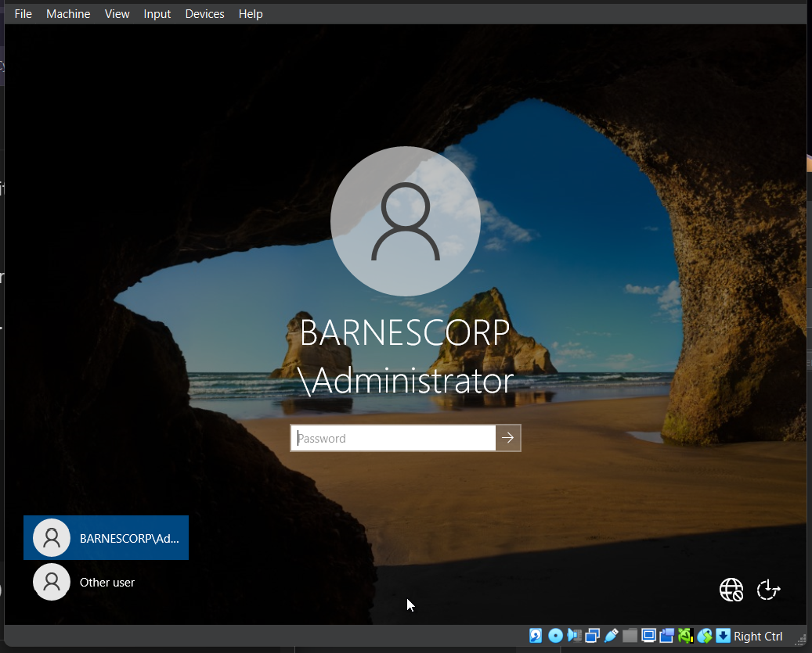
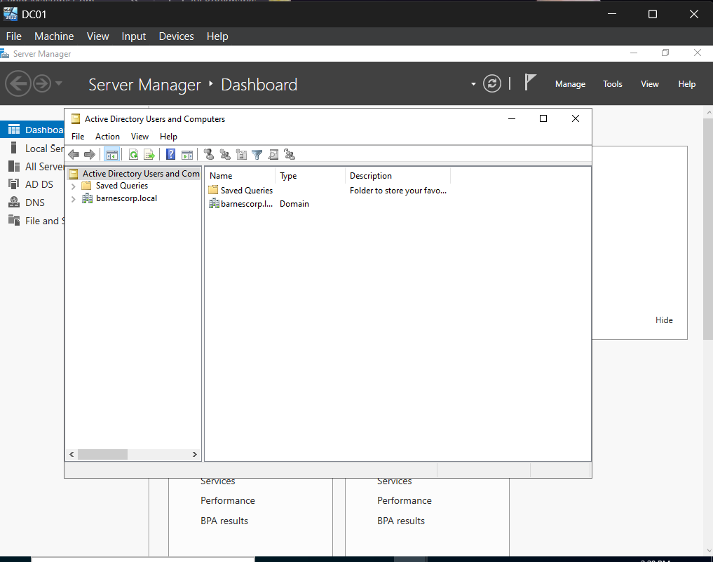
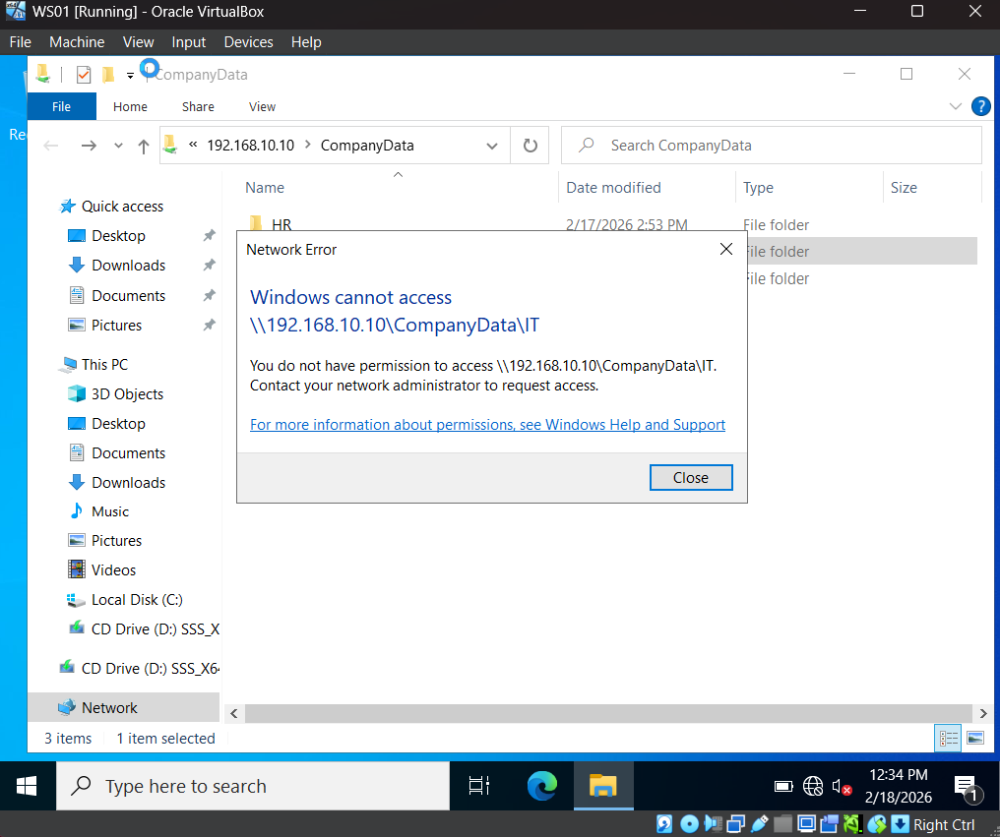

# Windows Server Active Directory Lab

## Overview

This project simulates a small business network built from scratch using Windows Server and a domain-joined workstation.
The goal was to understand how organizations manage users, authentication, and file access using Active Directory.

Domain: **barnescorp.local**

---

## Technologies Used

* Windows Server 2022
* Active Directory Domain Services (AD DS)
* DNS
* NTFS Permissions
* Windows Client Workstation
* Oracle VirtualBox Networking

---

## Network Design

Departments created:

* HR
* IT
* Sales

Each department should only access its own files.

---

## 1. Server Installation

Windows Server was installed in a virtual environment.

---

## 2. Domain Controller Promotion

The server was promoted to a Domain Controller and the Active Directory domain was created.

---

## 3. Active Directory Configuration

Organizational Units, users, and security groups were created.

---

## 4. Client Domain Join

A workstation was joined to the domain and authenticated with domain credentials.

---

## 5. Access Control Testing

Shared folders were configured and tested using a Sales user account.

Sales user:

* Access allowed: Sales folder
* Access denied: HR and IT folders

---

## Troubleshooting Performed

* DNS configuration preventing domain join
* User authentication failures
* Network adapter connectivity in virtual network
* NTFS permission inheritance conflicts

---

## What I Learned

This lab demonstrated how authentication relies on DNS and how group membership controls authorization in enterprise environments.
It also reinforced troubleshooting workflow for real domain environments.

---

## Author

Katie Barnes
